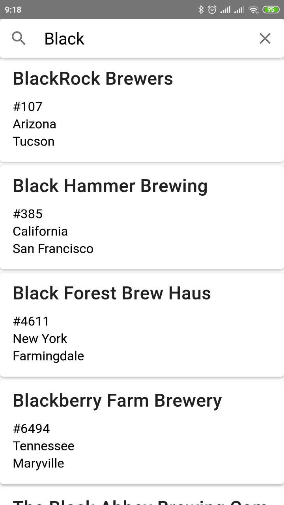

# React Native Awesome Breweries App

Simple application to search for breweries<br>
the purpose of development is to study the **react native** technology



## Key notes

-   application developed and tested only on real android device in development mode using android-studio
-   Architecture design borrowed from https://github.com/rodmax/react-playground/blob/master/docs/application-structure.md
    and is rather opinionated than recommended
-   Status:
    -   ✅ List with infinite scroll
    -   ✅ Text search
    -   ✅ open details modal when click to item
    -   ⚠️ view part of application(layout,styles,components) - so-so :( too much _StackOverflow_ approach without fundamental understanding
    -   🟥 advanced filter: not implemented yet.
        It seems the logic should be similar to search by text: button, modal form, dispatch filterChange event, reload data
    -   🟥 not considered at all:
        -   performance(redux,rxjs is good choice for mobile?)
        -   cross-platform
        -   production build & deploy
        -   and some more...
    -   🐛 Few known [issues](https://github.com/rodmax/rn-awesome-breweries-app/issues)

## Development

### Android

1️⃣ start android-studio

```bash
# NOTE: bellow task assumes that  android-studio binary lives
# in $HOME/android-tools/android-studio/bin/
# if no, please run it manually
npm run android-studio
```

2️⃣ start metro (in separate long live terminal)

```bash
npm run start
```

3️⃣ start android device

```bash
npm run android
```
